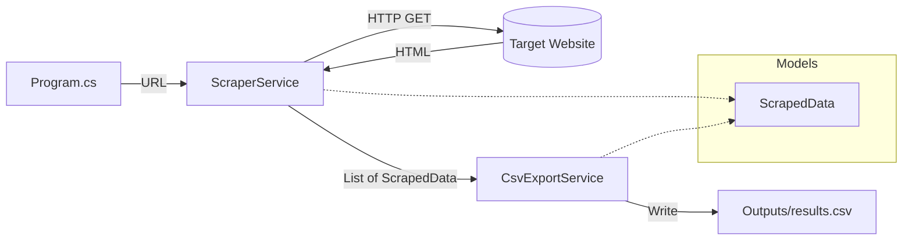

<div align="center">

# Web Scraper

**A lightweight C# console app that scrapes product data from the web and exports it to CSV.**

[](https://dotnet.microsoft.com/)
[](https://docs.microsoft.com/en-us/dotnet/csharp/)
[](https://html-agility-pack.net/)
[](https://joshclose.github.io/CsvHelper/)

*Fetch HTML → parse with XPath → export structured data in seconds.*

[Getting Started](#-getting-started) ·
[Usage](#-usage) ·
[Architecture](#-architecture) ·
[Project Structure](#-project-structure)

</div>

---

## Overview

Web Scraper is a beginner-friendly .NET console application that demonstrates a real-world data pipeline:

1. **Download** a web page with `HttpClient`
2. **Parse** the HTML with HtmlAgilityPack
3. **Extract** structured fields into C# objects
4. **Export** the results to a clean CSV file

Out of the box, it targets [books.toscrape.com](https://books.toscrape.com/) — a sandbox site built specifically for learning web scraping.

---

## Features

| | |
|---|---|
| **Async HTTP fetching** | Non-blocking page downloads via `HttpClient` |
| **XPath selectors** | Precise HTML element targeting with HtmlAgilityPack |
| **Typed data model** | Strongly-typed `ScrapedData` class with CSV column mapping |
| **CSV export** | Human-readable headers powered by CsvHelper |
| **CLI-friendly** | Pass any compatible URL as a command-line argument |
| **Clean architecture** | Separated Models, Services, and entry point |

---

## Architecture



**Data flow**

```
URL  →  ScraperService  →  List<ScrapedData>  →  CsvExportService  →  results.csv
```

---

## Project Structure

```
web-scraper-c-sharp/
├── README.md
├── web-scraper.sln
└── src/
    └── web-scraper/
        ├── Models/
        │   └── ScrapedData.cs        # Data shape + CSV column headers
        ├── Services/
        │   ├── ScraperService.cs     # HTTP fetch + HTML parsing
        │   └── CsvExportService.cs   # CSV file writer
        ├── Outputs/
        │   └── results.csv           # Generated output (gitignored)
        ├── Program.cs                # Entry point
        └── web-scraper.csproj
```

---

## Getting Started

### Prerequisites

- [.NET 10 SDK](https://dotnet.microsoft.com/download) or later

Verify your install:

```bash
dotnet --version
```

### Installation

```bash
git clone https://github.com/<your-username>/web-scraper-c-sharp.git
cd web-scraper-c-sharp/src/web-scraper
dotnet restore
```

### Build

```bash
dotnet build
```

---

## Usage

### Default scrape

Runs against `https://books.toscrape.com/` and writes to `Outputs/results.csv`:

```bash
dotnet run
```

### Custom URL

```bash
dotnet run -- https://books.toscrape.com/catalogue/page-2.html
```

### Example output

```
Scraping https://books.toscrape.com/...
Saved 20 records to Outputs/results.csv
```

### Sample CSV

```csv
Title,Description,Price,Image URL
A Light in the Attic,A Light in the Attic,£51.77,https://books.toscrape.com/media/cache/2c/da/2cdad67c44b002e7ead0cc35693c0e8b.jpg
Tipping the Velvet,Tipping the Velvet,£53.74,https://books.toscrape.com/media/cache/26/0c/260c6ae16bce31c8f8c95daddd9f4a1c.jpg
```

---

## How It Works

### 1. Fetch the page

`ScraperService` downloads the raw HTML from the target URL using a reusable `HttpClient` instance.

### 2. Parse the DOM

HtmlAgilityPack loads the HTML into a navigable document tree, allowing XPath queries against the page structure.

### 3. Extract product data

Each book card (`<article class="product_pod">`) is scanned for:

| Field | Source |
|-------|--------|
| **Title** | `h3 > a` title attribute or link text |
| **Description** | `img` alt text |
| **Price** | `p.price_color` inner text |
| **Image URL** | `img` src, resolved to a full URL |

### 4. Export to CSV

`CsvExportService` writes the results using CsvHelper, with column headers defined via `[Name]` attributes on the model.

---

## Practice URLs

These sites work with the current selectors (all part of the [ToScrape](https://toscrape.com/) sandbox):

| Page | URL |
|------|-----|
| Home | `https://books.toscrape.com/` |
| Page 2 | `https://books.toscrape.com/catalogue/page-2.html` |
| Travel category | `https://books.toscrape.com/catalogue/category/books/travel_2/index.html` |

> **Note:** Other sites (e.g. quotes.toscrape.com) use different HTML structures and require updated XPath selectors in `ScraperService.cs`.

---

## Tech Stack

| Package | Version | Purpose |
|---------|---------|---------|
| [HtmlAgilityPack](https://www.nuget.org/packages/HtmlAgilityPack) | 1.12.4 | HTML parsing & XPath queries |
| [CsvHelper](https://www.nuget.org/packages/CsvHelper) | 33.1.0 | CSV serialization |
| .NET | 10.0 | Runtime & SDK |

---

## Adapting for Other Sites

To scrape a different website, update the XPath selectors in `ScraperService.cs`:

```csharp
// Current selector — books.toscrape.com product cards
var products = document.DocumentNode.SelectNodes("//article[@class='product_pod']");
```

Inspect the target site's HTML (browser DevTools → Elements), identify the repeating container and field selectors, then swap them in. You may also want to extend `ScrapedData` with additional properties.

---

## License

This project is open source. Use it freely for learning and experimentation.

---

<div align="center">

**Built with C# and curiosity.**

</div>
